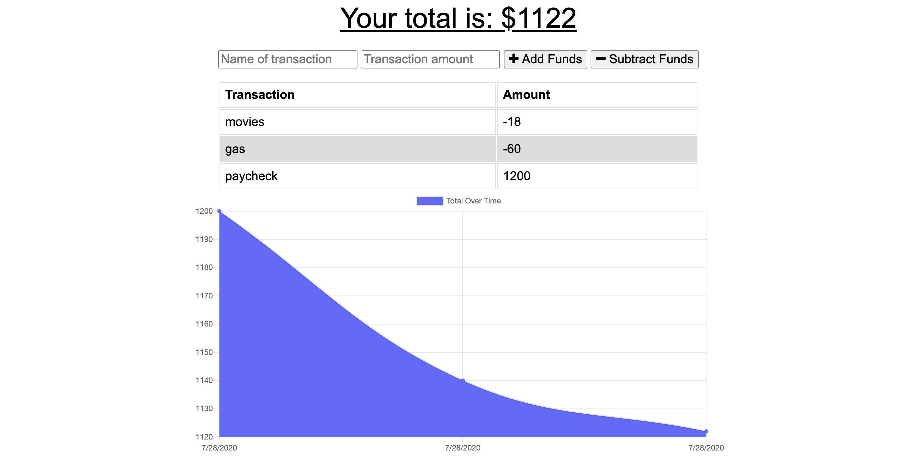

# PWA

## Description
This is an application that can be used to create, view and update a database to keep track of different transactions that may take place during a day. The user will be able to add expenses and deposits to their budget with or without a connection. When entering transactions offline, they should populate the total when brought back online.

 

## Table of Contents 
* [Installation](#installation)
* [Usage](#usage)
* [Credits](#credits)
* [MIT License](#MIT-License)
* [Contributing](#Contributing)

## Installation
No installation required.  You can just visit the deployed application here:
[Budget Tracker Tracker](https://quiet-journey-47914.herokuapp.com/)

## Usage 
You can use this app to store, view and modify your transactions online as well as offline.

## Test Instructions

No tests at the moment.

## MIT License

This project is licensed under the MIT license.

## Contributing

No collaborators at this time but you are more than welcome to improve it!

## Questions

If you have any questions pleae direct them to my email address: diegocordoba87@gmail.com or contact me via GitHub here: 
https://github.com/diegocordoba87
 

